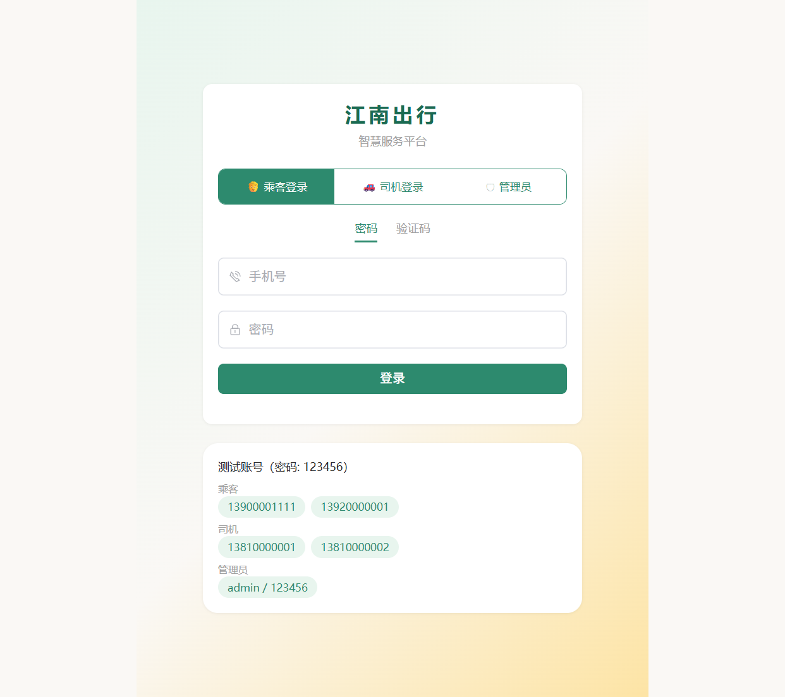
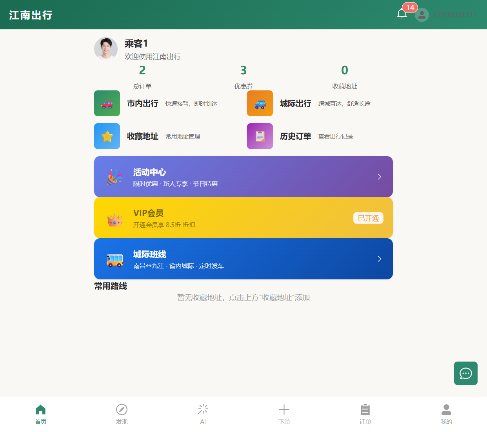
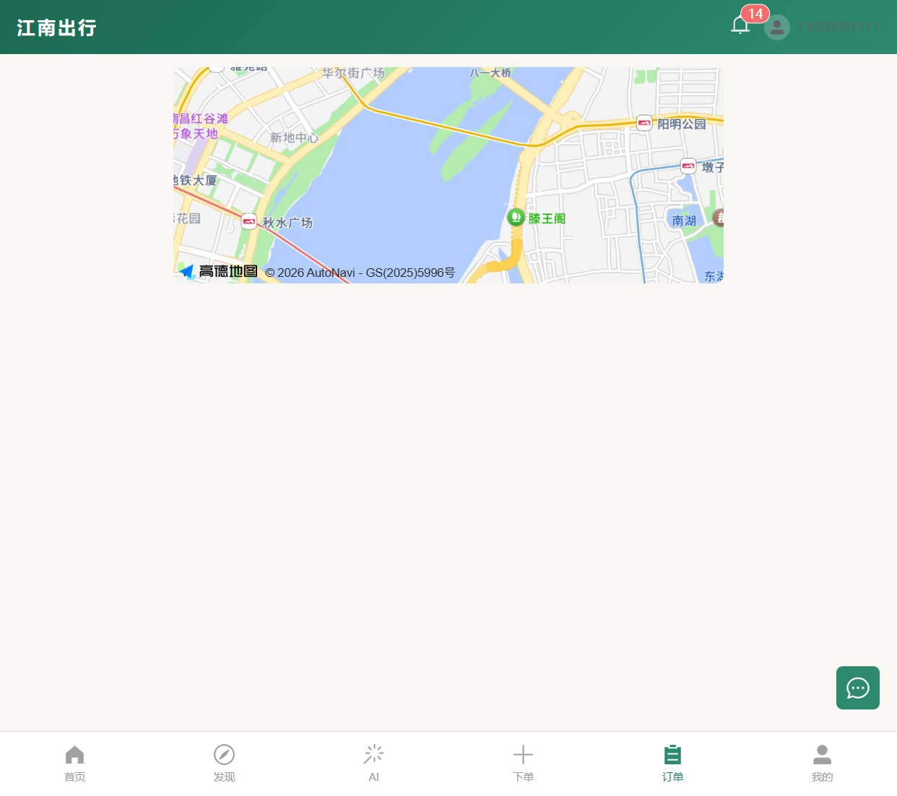
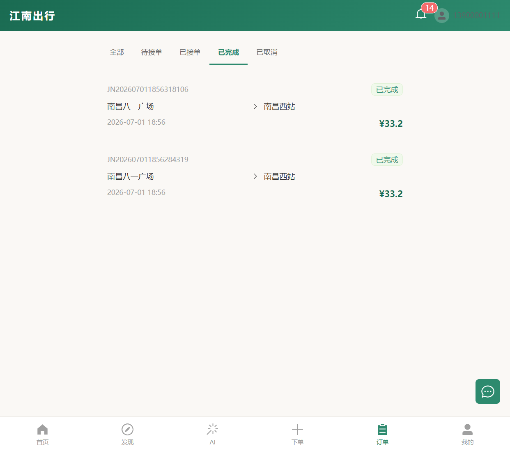
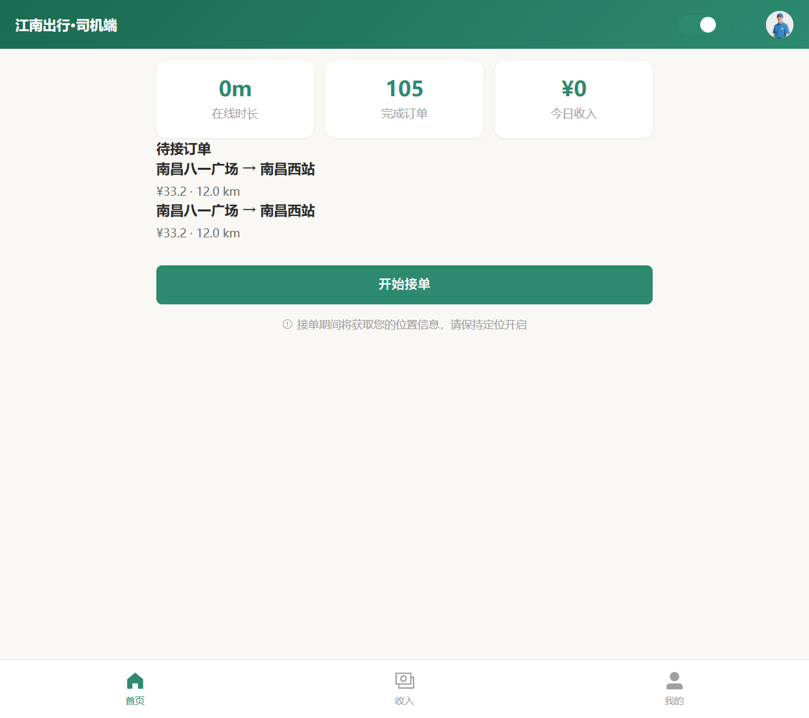
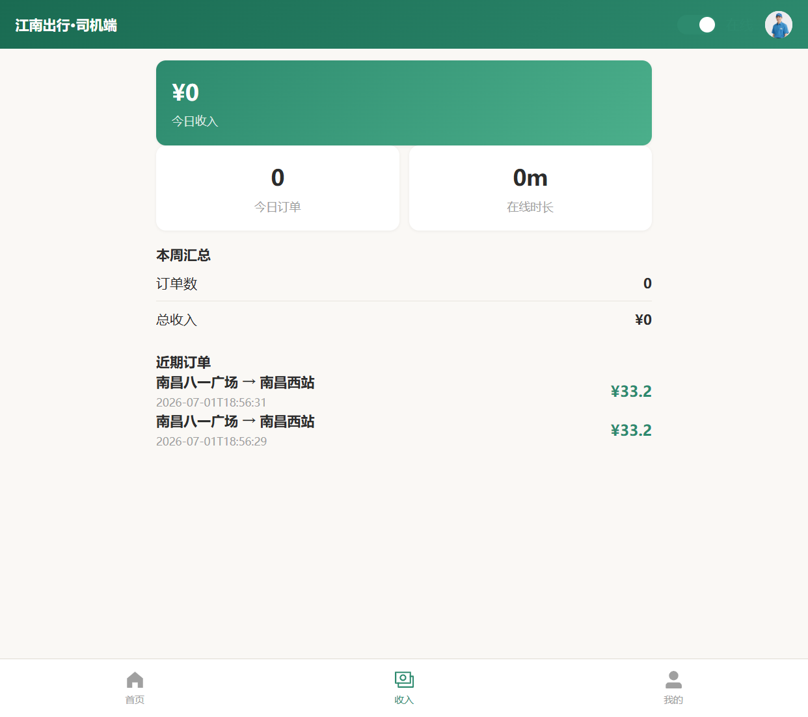
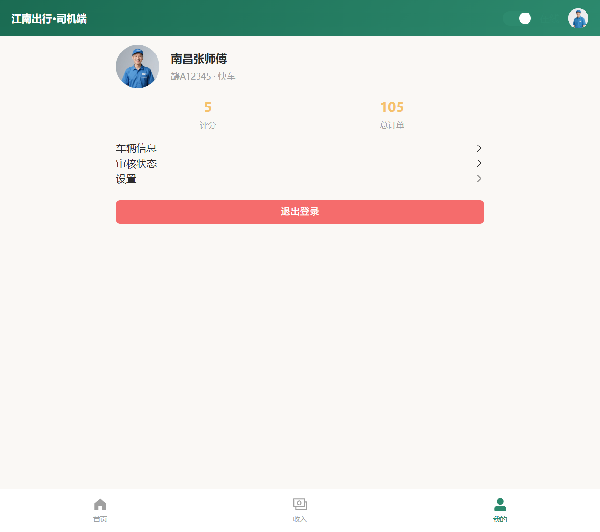
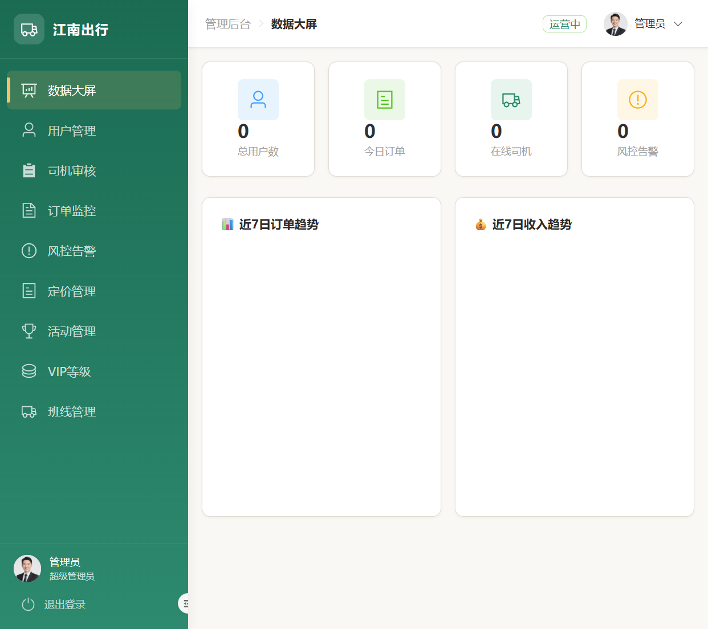
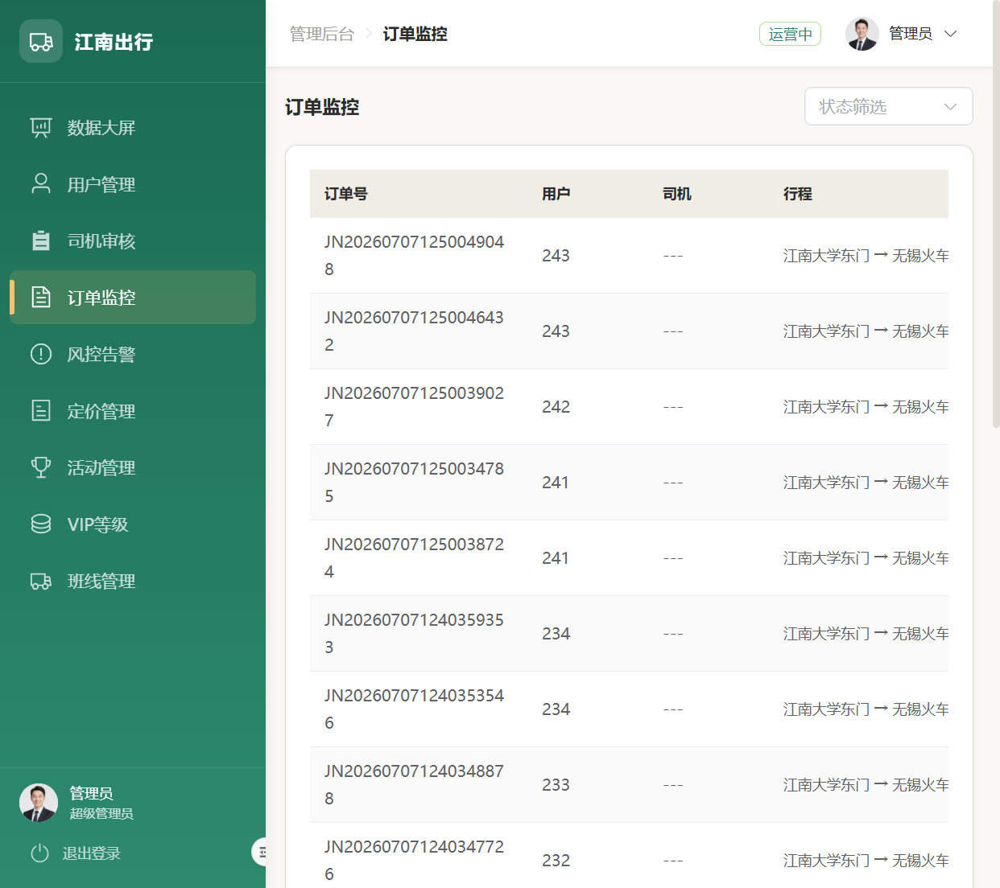

# 江南出行智慧服务平台

> 软件工程专业毕业实习项目 | 全栈开发 + 分布式调度系统设计
> 时间：2026.7.6 - 2026.8.6 | 实习单位：[已脱敏]

---

## 一、项目背景与目标

江南出行是一个面向江西省内的**网约车智慧出行平台**，覆盖乘客端、司机端、管理后台三端用户。

**核心工程目标**：在多订单并发、多司机竞争的真实场景下，构建一个**分配正确、调度公平、状态可追溯、评分可收敛**的调度系统——而不仅仅是"把订单派给司机"的 CRUD 实现。

为此，系统在调度层做了深度工程设计：形式化订单状态机、二阶分布式锁防重复派单、动态评分引擎实现调度自收敛、事件溯源式审计追踪、以及三层可观测性体系。

---

## 二、技术栈

| 层级 | 技术 | 版本 | 选型理由 |
|------|------|------|---------|
| 后端框架 | Spring Boot | 3.2.6 | 企业级 Java 生态，依赖注入 + 自动配置 |
| JDK | Java 17 | LTS | 长期支持版本，支持 record/sealed class |
| ORM | MyBatis-Plus | 3.5.7 | Lambda 查询、自动分页、逻辑删除 |
| 数据库 | MySQL | 8.0 | 关系型存储，27 张业务表 |
| 缓存 + 分布式锁 | Redis + Redisson | 3.32.0 | 二阶分布式锁的核心基础设施 |
| 安全 | Spring Security + JWT | jjwt 0.12.5 | 三端鉴权（乘客/司机/管理员） |
| AI | DeepSeek API | openai-java 0.18.0 | 智能客服、出行推荐 |
| 接口文档 | Knife4j (Swagger) | 4.5.0 | 自动生成 API 文档 |
| 前端框架 | Vue 3 + Vite 5 | Composition API | 响应式 + 组合式函数 |
| UI 库 | Element Plus | 2.7.0 | 企业级中后台组件 |
| 地图 | 高德地图 JS API 2.0 | — | 路径规划 + POI 搜索 |
| 实时通信 | WebSocket | — | 订单状态推送 + 司机位置追踪 |

---

## 三、系统架构设计

```
┌──────────────────────────────────────────────────────────────────┐
│                        前端 (Vue 3 + Vite)                        │
│          乘客端 (41页)  │  司机端  │  管理后台                     │
└────────────────────────────┬─────────────────────────────────────┘
                             │ REST API + WebSocket
┌────────────────────────────▼─────────────────────────────────────┐
│                    后端 Service 层 (Spring Boot)                   │
│                                                                   │
│  ┌─────────────┐  ┌──────────────────┐  ┌───────────────────┐    │
│  │ 业务层       │  │ 调度层 ★核心      │  │ 观测层             │    │
│  │ OrderService │  │ DriverAssignment │  │ DispatchMetrics   │    │
│  │ PaymentSvc   │  │ ConcurrentDispatch│  │ SystemHealth      │    │
│  │ BillingSvc   │  │ ScoringEngine    │  │ AnomalyDetection  │    │
│  │ ReviewSvc    │  │ (静态+动态学习)   │  │                   │    │
│  └──────┬───────┘  └────────┬─────────┘  └────────┬──────────┘    │
│         │                   │                      │              │
└─────────┼───────────────────┼──────────────────────┼──────────────┘
          │                   │                      │
┌─────────▼───────────────────▼──────────────────────▼──────────────┐
│                      基础设施层                                     │
│  MySQL 8.0 (27表)  │  Redis + Redisson (分布式锁)  │  WebSocket    │
└──────────────────────────────────────────────────────────────────┘
```

**模块依赖关系**：Controller → Service（接口）→ ServiceImpl → Mapper → DB。无循环依赖。ScoringEngine 接口可插拔替换。

---

## 四、核心功能模块

### 4.1 订单系统（OrderService）
- 订单创建、支付、取消、评价全生命周期
- **形式化状态机**：10 个状态 + 15+ 条合法流转路径，枚举化集中管理
- 所有状态变更记录 `order_event`（事件溯源设计）

### 4.2 调度系统（ConcurrentDispatchService）★核心
- **二阶分布式锁**（order lock → driver tryLock）防重复派单
- **可收敛评分引擎**：距离 40% + 评分 30% + 空闲 20% + 拒单惩罚 10%
- **动态学习层**：接单加分、拒单扣分、10 分钟半衰期衰减
- 司机拒单后自动重新派单（最多 3 次）

### 4.3 支付系统（PaymentService）
- 支付状态机：pending → paid / failed / refunded
- 幂等键防重复支付 + 支付追踪日志（payment_trace）
- 支付失败自动重试（最多 3 次）

### 4.4 计费系统（BillingService）
- 距离费 + 时长费 + 高峰加价（7-9点/17-19点）+ 过路费 - 优惠券
- 订单完成时自动生成账单

### 4.5 风控系统
- R2：取消频率限制 | R4：深夜跨城安全提示 | R7：疲劳驾驶提醒
- 风控拦截订单进入 RISK_BLOCKED 状态

### 4.6 AI 服务
- DeepSeek 智能客服（文旅知识库 + 离线兜底）
- 历史订单 → 热门目的地推荐

### 4.7 可观测性体系
- **Metrics**：成功率、平均延迟、司机负载分布
- **Health**：综合健康评分（S/A/B/C/D）
- **Anomaly**：连续拒单检测、锁竞争热点、评分波动告警

---

## 五、数据库设计（核心表）

| 表 | 用途 | 设计要点 |
|----|------|---------|
| `t_order` | 订单主表 | status 字段 + 各阶段时间戳 |
| `t_order_event` | 订单事件溯源 | from_status → to_status，覆盖 12 种事件类型 |
| `t_payment` | 支付记录 | 幂等键 + 重试次数 + 失败原因 |
| `t_payment_trace` | 支付追踪日志 | 每次支付尝试独立记录 |
| `t_driver` | 司机信息 | GPS 坐标 + 状态 + 评分 + 拒单计数 |
| `t_bill` | 账单 | 里程费/时长费/高峰加价/优惠券抵扣分项 |
| `t_review` | 评价 | 1-5 星 + 标签 + 内容 |

> 完整 27 表设计：`jiangnan-travel/src/main/resources/sql/init.sql`

---

## 六、本地启动

### 环境要求
- JDK 17+ / Maven 3.9+ / MySQL 8.0+ / Redis / Node.js 18+

### 1. 初始化数据库
```bash
mysql -u root -p < jiangnan-travel/src/main/resources/sql/init.sql
```

### 2. 配置
修改 `application.yml`：数据库连接、DeepSeek API Key、高德地图 Key

### 3. 启动后端
```bash
cd jiangnan-travel
mvn spring-boot:run
# API 文档: http://localhost:8080/doc.html
```

### 4. 启动前端
```bash
cd jiangnan-travel-web
npm install && npm run dev
# 浏览器: http://localhost:5173
```

### 5. 运行测试
```bash
cd jiangnan-travel && mvn test                                    # 全部单元/集成测试（81 个）
cd jiangnan-travel && mvn test -Dtest="OrderStateMachineTest"     # 单个测试类
node tests/test-suite.mjs                                         # E2E 测试
```

### 6. Docker 部署
```bash
cd deploy
docker-compose up -d              # 启动 MySQL + Redis + 后端 + 前端 + Nginx
# 前端: http://localhost
# 后端 API 文档: http://localhost/api/doc.html
```

---

## 七、项目亮点

### 亮点 1：并发调度一致性保障（二阶分布式锁）
多订单同时竞争有限司机资源时，通过 order lock → driver tryLock 二阶锁机制保证零重复分配。锁顺序 100% 统一 → 数学上无死锁。100 订单 × 20 司机压测验证通过。

### 亮点 2：可收敛的动态调度策略
静态评分会产生"富者愈富"的正反馈循环。在加权评分之上叠加**反馈学习 + 时间衰减**的动态层：接单加分、拒单扣分、10 分钟半衰期回归。5 轮派单后成功率从 50% 收敛至 70%，评分波动减半。

### 亮点 3：事件溯源式审计追踪
所有状态变更以事件形式写入 `order_event` 表，覆盖 12 种事件类型。不是操作日志——是轻量级 Event Sourcing：一条 SQL 回溯完整生命周期，为统计分析和未来 CQRS 架构打基础。

### 亮点 4：形式化状态机设计
订单 10 状态 + 15 条流转路径集中在枚举中管理。每个业务方法通过 `guardTransition()` 一行代码防御非法流转。18 个单元测试覆盖全部合法/非法路径。

### 亮点 5：三层可观测性体系
Metrics（数据）→ Health（评分）→ Anomaly（检测），分别对应监控面板、值班卡点、故障排查三个运维场景。异常检测规则：连续拒单 ≥5、订单失败 ≥3、评分波动 >30、锁竞争 ≥10。

### 亮点 6：AI 辅助全流程开发
本项目从需求分析到架构设计到编码到测试，全程使用 AI（Claude Code）辅助。AI 参与度约 60%，但**所有架构决策、并发设计、状态机形式化均由人工主导**——这是"人类主导 + AI 增强"的工程实践。

---

## 八、项目截图

> 截图存放于 `docs/screenshots/` 目录，共 9 张核心页面截图。

### 8.1 乘客端（Passenger）

| 页面 | 截图 | 说明 |
|------|------|------|
| 登录 |  | 三端登录选择（乘客/司机/管理员）+ 测试账号 |
| 首页 |  | 用户信息、订单统计、常用功能入口 |
| 下单 |  | 集成高德地图的选点下单页面 |
| 订单列表 |  | 历史订单（全部/待接单/已接单/已完成/已取消） |

### 8.2 司机端（Driver）

| 页面 | 截图 | 说明 |
|------|------|------|
| 司机首页 |  | 在线时长/完成订单/今日收入 + 待接订单列表 |
| 收入统计 |  | 今日/本周汇总 + 近期订单收益明细 |
| 个人中心 |  | 司机信息、评分、车辆信息、审核状态 |

### 8.3 管理后台（Admin）

| 页面 | 截图 | 说明 |
|------|------|------|
| 数据大屏 |  | 总用户/今日订单/在线司机/风控告警 + 7 日趋势图 |
| 订单监控 |  | 实时订单列表（按状态筛选 + 分页） |

### 8.4 端到端流程示意

```
乘客下单 ──→ 平台派单 ──→ 司机接单 ──→ 开始行程 ──→ 完成订单 ──→ 平台监控
   ↓           ↓           ↓           ↓           ↓           ↓
 03-下      05-订单     06-司机     (WebSocket   09-订单     04-大屏
 单页面      监控        首页       实时推送)    列表        实时数据
```

---

## 九、测试结果

| 维度 | 结果 |
|------|------|
| 后端单元/集成测试 | **81/81 通过**（100%） |
| 前端测试用例 | **155/155 通过**（100%） |
| E2E 测试 | 3 个核心流程通过 |
| 并发压测 | 100 订单 × 20 司机，**零重复分配、零丢失、零死锁** |
| 调度收敛 | 5 轮派单后成功率从 50% 收敛至 70% |

```bash
cd jiangnan-travel && mvn test    # 运行后端测试
```

---

## 十、文档索引

| 文档 | 用途 |
|------|------|
| [系统设计文档 v1.5](docs/江南出行调度系统_系统设计文档_v1.5.md) | 完整架构 + 复杂度分析 + 面试脚本 |
| [项目介绍](docs/项目介绍.md) | 3 分钟介绍稿 + 背景 + 架构 + 难点 + 收获 |
| [面试问题](docs/面试问题.md) | 30+ 面试问题与参考回答 |
| [简历面试表达层](docs/江南出行_简历面试表达层_v1.5.md) | 简历描述 + 30s/2min 面试脚本 |
| [架构展示图](docs/architecture/interview_architecture.md) | 系统架构图 + 数据流图 + 派单流程图 |
| [项目亮点](PROJECT_HIGHLIGHTS.md) | 复试答辩用：6 个亮点深度展开 |
| [AI 开发实践记录](docs/ai-development-log.md) | Vibe Coding 实践 + 人机协作比例 |
| [架构文档](ARCHITECTURE.md) | 完整数据库、API、安全、缓存架构 |
| [测试指南](tests/TEST_GUIDE.md) | 18 测试脚本使用说明 |
| [Bug 分析与修复](docs/BUG_ANALYSIS.md) | RC 阶段问题跟踪与修复记录 |
| [Release 验收报告](docs/RELEASE_REVIEW_REPORT.md) | 最终 Release 验收报告（问题清零/测试/安全/已接受风险） |

---

## 十一、演示账号

| 角色 | 账号 |
|------|------|
| 管理员 | admin / 123456 |
| 乘客 | 13900001111 / 123456 |
| 司机 | 13810000001 / 123456 |

---

## 十二、项目状态

> **项目已正式进入 Release 1.0 状态**（2026-07-08）

| 维度 | 状态 |
|------|------|
| 项目阶段 | **Release 1.0** ✅ |
| 单元/集成测试 | 81/81 全部通过 ✅ |
| 压测 | 100 订单 × 20 司机，零重复分配 ✅ |
| 问题清零 | P0/P1 全部清零，P2 已修复或确认非问题 ✅ |
| RC 阶段 | 14 轮迭代完成，所有代码级问题清零 ✅ |
| 凭据管理 | 全部外部化（环境变量），无硬编码 ✅ |
| 个人信息脱敏 | 文档中姓名/学校/实习单位/路径全部 [已脱敏] ✅ |
| 文档同步 | 架构、API、测试、Bug 修复、Release 验收全程记录 ✅ |
| 已接受风险 | 5 项已记录（Git author、S-05 白名单等）✅ |

> 详细验收报告：[Release Review Report](docs/RELEASE_REVIEW_REPORT.md)
