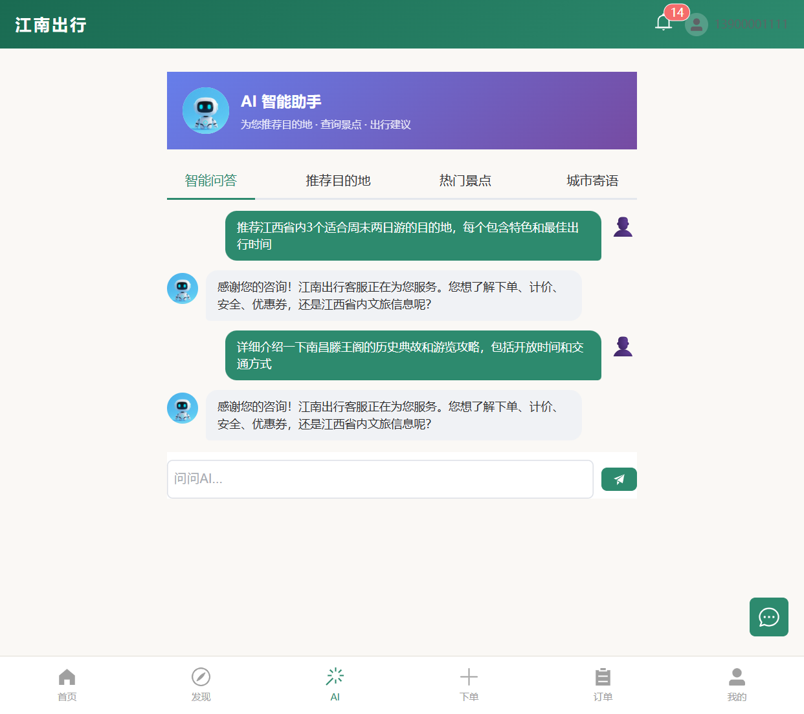
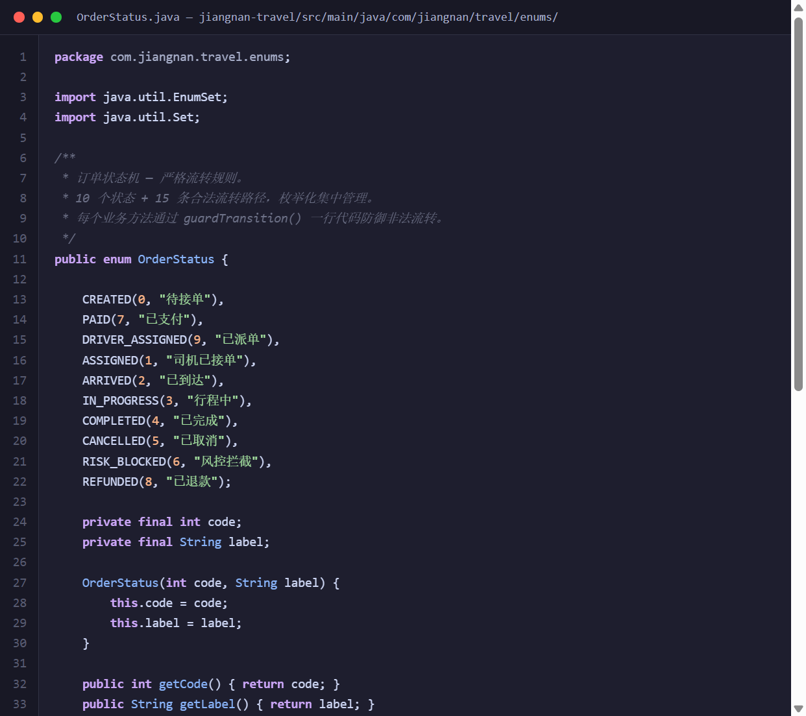
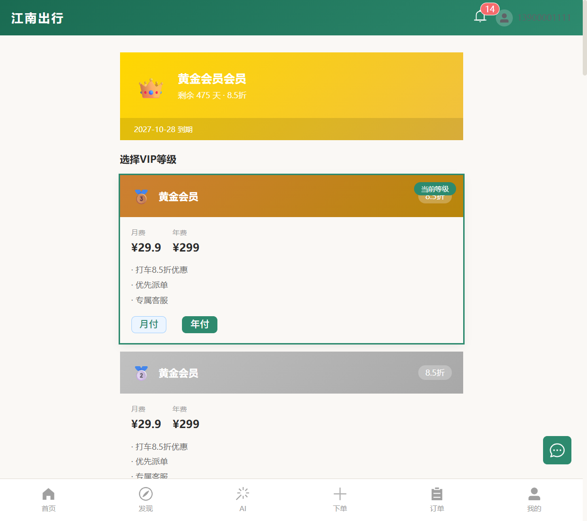
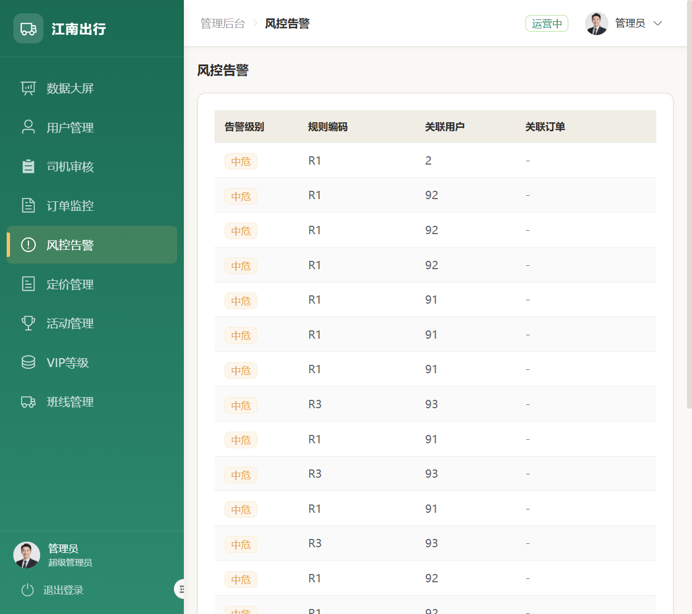

# 江南出行智慧服务平台

[](https://github.com/l535304334/jiangnan-travel/actions/workflows/ci.yml)
[](LICENSE)


一个面向江西省内的**网约车智慧出行平台**，覆盖乘客端、司机端、管理后台三端。

核心工程目标不是"把订单派给司机"的 CRUD，而是在多订单并发、多司机竞争的真实场景下构建一个**分配正确、调度公平、状态可追溯、评分可收敛**的调度系统：形式化订单状态机、二阶分布式锁防重复派单、动态评分引擎自收敛、事件溯源式审计追踪、三层可观测性体系。

> 项目背景：软件工程专业毕业实习项目（2026.07），采用"人类主导 + AI 增强"的开发模式完成，实践记录见 [AI 开发日志](docs/ai-development-log.md)。

---

## 一、核心亮点

| # | 亮点 | 一句话 |
|---|------|--------|
| 1 | **二阶分布式锁派单** | order lock → driver tryLock，锁顺序全局统一 → 数学上无死锁；100 订单 × 20 司机压测零重复分配 |
| 2 | **可收敛动态调度** | 静态评分会"富者愈富"；叠加接单加分/拒单扣分 + 10 分钟半衰期衰减后，5 轮派单成功率 50% → 70% |
| 3 | **形式化状态机** | 订单 10 状态 + 15 条合法流转集中在 `OrderStatus` 枚举，`guardTransition()` 一行防御非法流转，18 个单元测试全覆盖 |
| 4 | **事件溯源审计** | 所有状态变更写入 `order_event`（12 种事件类型），一条 SQL 回溯完整生命周期 |
| 5 | **三层可观测性** | Metrics（数据）→ Health（S/A/B/C/D 评分）→ Anomaly（连续拒单/锁竞争/评分波动检测） |
| 6 | **AI 全流程协作** | 从需求到测试全程 AI 辅助（参与度约 60%），架构决策与并发设计人工主导 |

深度展开：[PROJECT_HIGHLIGHTS.md](PROJECT_HIGHLIGHTS.md) · 系统设计与复杂度分析：[docs/系统设计文档](docs/江南出行调度系统_系统设计文档_v1.5.md)

---

## 二、技术栈

| 层级 | 技术 | 版本 | 选型理由 |
|------|------|------|---------|
| 后端框架 | Spring Boot | 3.2.6 | 企业级 Java 生态，依赖注入 + 自动配置 |
| JDK | Java 17 | LTS | record / sealed class / 模式匹配 |
| ORM | MyBatis-Plus | 3.5.7 | Lambda 查询、自动分页、逻辑删除 |
| 数据库 | MySQL | 8.0 | 关系型存储，27 张业务表 |
| 缓存 + 分布式锁 | Redis + Redisson | 3.32.0 | 二阶分布式锁的核心基础设施 |
| 安全 | Spring Security + JWT | jjwt 0.12.5 | 三端鉴权 + Redis Token 黑名单 |
| AI | DeepSeek API | openai-java 0.18.0 | 智能客服（SSE 流式 + 离线兜底）、出行推荐 |
| 接口文档 | Knife4j (OpenAPI 3) | 4.5.0 | `/doc.html` 自动生成 |
| 前端框架 | Vue 3 + Vite 5 | Composition API | 响应式 + 组合式函数 |
| UI | Element Plus | 2.7 | 叠加"水墨江南"设计 token 体系定制 |
| 地图 | 高德 JS API 2.0 | — | 路径规划 + POI 搜索 |
| 实时通信 | WebSocket | — | 订单状态推送 + 司机位置追踪（Cookie 握手鉴权） |

---

## 三、系统架构

```
┌──────────────────────────────────────────────────────────────────┐
│                        前端 (Vue 3 + Vite)                        │
│           乘客端  │  司机端  │  管理后台（三端一体）               │
└────────────────────────────┬─────────────────────────────────────┘
                             │ REST API + WebSocket
┌────────────────────────────▼─────────────────────────────────────┐
│                    后端 Service 层 (Spring Boot)                   │
│  ┌─────────────┐  ┌──────────────────┐  ┌───────────────────┐    │
│  │ 业务层       │  │ 调度层 ★核心      │  │ 观测层             │    │
│  │ OrderService │  │ DriverAssignment │  │ DispatchMetrics   │    │
│  │ PaymentSvc   │  │ ConcurrentDispatch│  │ SystemHealth      │    │
│  │ BillingSvc   │  │ ScoringEngine    │  │ AnomalyDetection  │    │
│  │ ReviewSvc    │  │ (静态+动态学习)   │  │                   │    │
│  └──────┬───────┘  └────────┬─────────┘  └────────┬──────────┘    │
└─────────┼───────────────────┼──────────────────────┼──────────────┘
┌─────────▼───────────────────▼──────────────────────▼──────────────┐
│  MySQL 8.0 (27表)  │  Redis + Redisson (分布式锁)  │  WebSocket    │
└──────────────────────────────────────────────────────────────────┘
```

依赖方向：`Controller → Service（接口）→ ServiceImpl → Mapper → DB`，无循环依赖，评分引擎（`ScoringEngine`）可插拔替换。完整架构（目录/分层/数据库/98 个 API/安全/缓存）见 **[ARCHITECTURE.md](ARCHITECTURE.md)**。

---

## 四、功能模块

- **订单系统**：创建/支付/取消/评价全生命周期；10 状态形式化状态机；全量事件溯源
- **调度系统** ★：二阶分布式锁防重复派单；距离 40% + 评分 30% + 空闲 20% + 拒单惩罚 10% 加权评分；动态学习层（接单加分、拒单扣分、10 分钟半衰期）；拒单自动重派（最多 3 次）
- **支付系统**：支付状态机 + 幂等键防重复支付 + `payment_trace` 追踪 + 失败自动重试
- **计费系统**：距离费 + 时长费 + 高峰加价（7-9 / 17-19 点）+ 过路费 − 优惠券/VIP 折扣
- **风控系统**：取消频率限制（R2）/ 深夜跨城提示（R4）/ 疲劳驾驶提醒（R7），拦截订单进入 RISK_BLOCKED
- **营销体系**：优惠券 / 活动中心 / VIP 多档会员（折扣联动计费）
- **AI 服务**：DeepSeek 智能客服（SSE 流式 + 文旅知识库离线兜底）、历史订单热门目的地推荐
- **可观测性**：调度指标、系统健康评分、异常检测告警

---

## 五、快速开始

**环境要求**：JDK 17+ / Maven 3.9+ / MySQL 8.0+ / Redis / Node.js 18+

```bash
# 1. 初始化数据库（27 表 + 种子数据 + 测试账号）
mysql -u root -p < jiangnan-travel/src/main/resources/sql/init.sql

# 2. 配置环境变量（复制模板并填写；完整说明见 docs/configuration.md）
cp deploy/.env.example deploy/.env

# 3. 启动后端 → http://localhost:8080（API 文档 /doc.html）
cd jiangnan-travel && mvn spring-boot:run

# 4. 启动前端 → http://localhost:5173
cd jiangnan-travel-web && npm install && npm run dev
```

**运行测试**：

```bash
powershell -File scripts/test-backend.ps1        # 后端全量（自动加载 deploy/.env）
cd jiangnan-travel-web && npm test               # 前端 vitest
node tests/test-suite.mjs                        # API 级 E2E（需前后端已启动）
```

**Docker 部署**：`cd deploy && docker-compose up -d`（MySQL + Redis + 后端 + 前端 + Nginx），详见 [deploy/DEPLOY_README.md](deploy/DEPLOY_README.md)。

**演示账号**（密码均为 `123456`）：管理员 `admin` · 乘客 `13900001111` · 司机 `13810000001`

---

## 六、项目截图

> 全部截图位于 `docs/screenshots/`（共 13 张）。

### 乘客端

| 页面 | 截图 | 说明 |
|------|------|------|
| 登录 |  | 三端登录选择 + 测试账号 |
| 首页 |  | 用户信息、订单统计、功能入口 |
| 下单 |  | 高德地图选点下单 |
| 订单列表 |  | 历史订单分状态筛选 |
| AI 客服 |  | DeepSeek 流式对话 + 会话管理 |

### 司机端

| 页面 | 截图 | 说明 |
|------|------|------|
| 司机首页 |  | 在线时长/完成订单/今日收入 + 待接订单 |
| 收入统计 |  | 今日/本周汇总 + 订单收益明细 |
| 个人中心 |  | 司机信息、评分、车辆、审核状态 |

### 管理后台

| 页面 | 截图 | 说明 |
|------|------|------|
| 数据大屏 |  | 总用户/今日订单/在线司机/告警 + 7 日趋势 |
| 订单监控 |  | 实时订单列表（状态筛选 + 分页） |

### 代码与功能展示

| 维度 | 截图 | 说明 |
|------|------|------|
| 代码质量 |  | 订单状态机枚举：10 状态 + 15 条合法流转 |
| 业务完整度 |  | VIP 多档等级、成长值、积分权益 |
| 安全意识 |  | 风控告警三级分类（频率/深夜跨城/疲劳驾驶） |

---

## 七、测试与质量

| 维度 | 结果 |
|------|------|
| 后端测试 | 11 个测试类 / **86 个用例全部通过**（2026-07-26 实测，含 5 个升级新增） |
| 前端单元测试 | 6 个用例（vitest，组合式函数层） |
| API 级 E2E | 24 个场景脚本 / 155 个用例（含并发调度/安全边界/压测），见 [tests/TEST_GUIDE.md](tests/TEST_GUIDE.md) |
| 并发压测 | 100 订单 × 20 司机：零重复分配、零丢失、零死锁 |
| 调度收敛 | 5 轮派单成功率 50% → 70%，评分波动减半 |
| CI | GitHub Actions：后端测试（MySQL/Redis 服务容器）+ 前端测试与构建 |

---

## 八、文档索引

完整文档导航（按"工程"与"求职展示"双轴组织）见 **[docs/README.md](docs/README.md)**。速览：

| 文档 | 用途 |
|------|------|
| [ARCHITECTURE.md](ARCHITECTURE.md) | 架构唯一事实源：目录/分层/数据库/API/安全/缓存 |
| [CONTRIBUTING.md](CONTRIBUTING.md) | 环境搭建、规范、测试、PR 流程 |
| [docs/系统设计文档](docs/江南出行调度系统_系统设计文档_v1.5.md) | 调度系统深度设计 + 复杂度分析 |
| [docs/configuration.md](docs/configuration.md) | 环境变量与配置总表 |
| [docs/troubleshooting.md](docs/troubleshooting.md) | FAQ 与故障排查 |
| [docs/UPGRADE_2026-07-26.md](docs/UPGRADE_2026-07-26.md) | 最近一次全面升级记录 |
| [docs/RELEASE_REVIEW_REPORT.md](docs/RELEASE_REVIEW_REPORT.md) | Release 1.0 验收报告（时点快照） |
| [AGENTS.md](AGENTS.md) | AI 代理开发入口（Claude Code / Cursor 等） |

---

## 九、项目状态

| 维度 | 状态 |
|------|------|
| 阶段 | Release 1.0（2026-07-08）+ 2026-07-26 全面升级 |
| 凭据管理 | 全部环境变量注入，无硬编码 |
| 个人信息 | 文档已脱敏，隐私文件不入库 |
| 许可证 | [MIT](LICENSE) |

> 2026-07-26 升级引入的改动（新端点 / 新测试 / UI 修复）的全量回归验证记录见 [docs/UPGRADE_2026-07-26.md](docs/UPGRADE_2026-07-26.md) 第八节。
